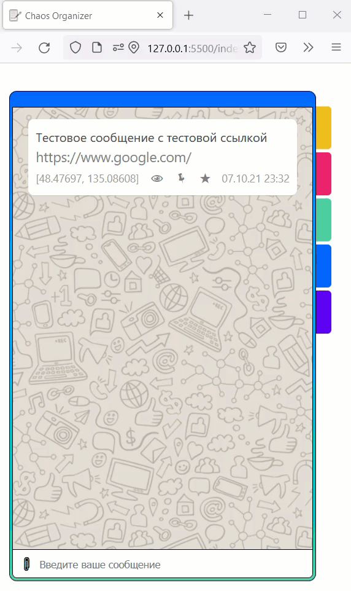
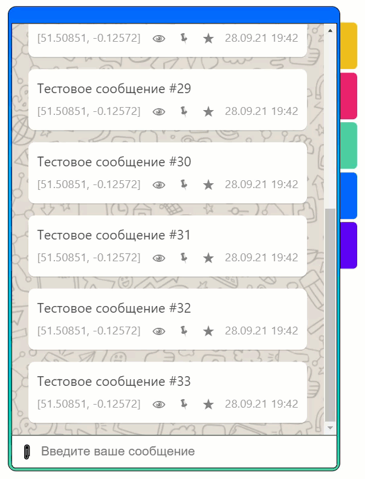
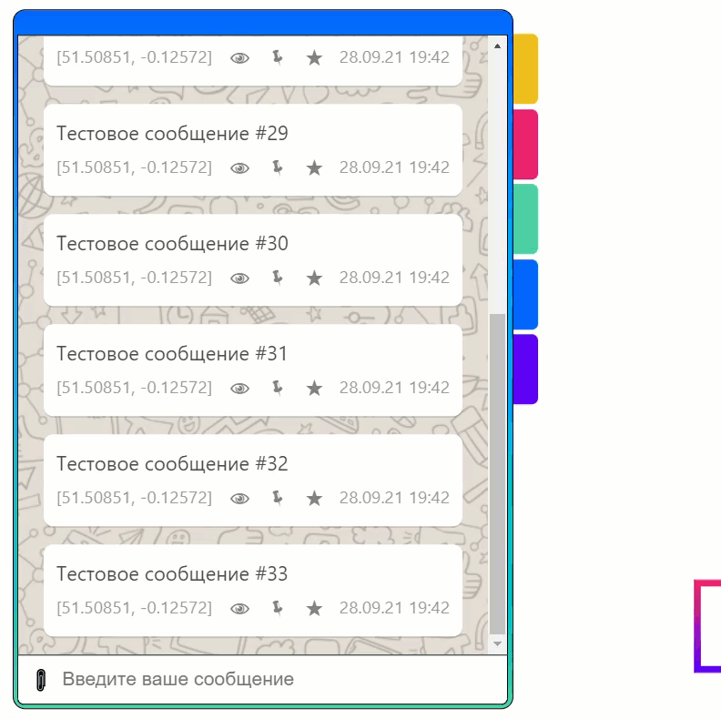
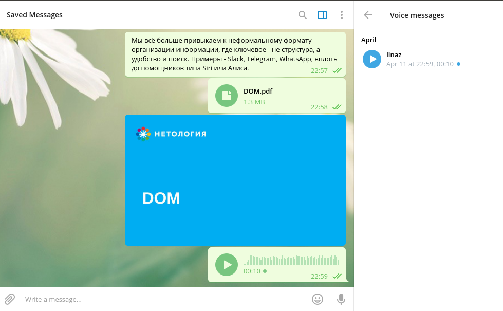
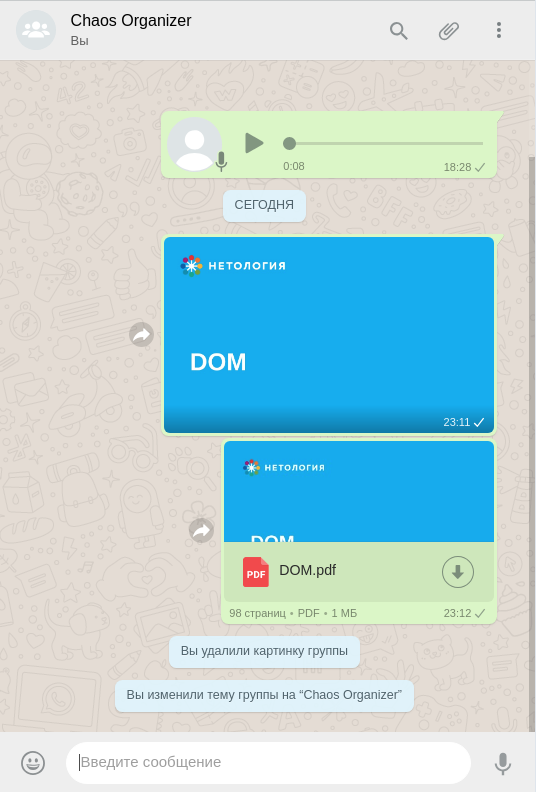
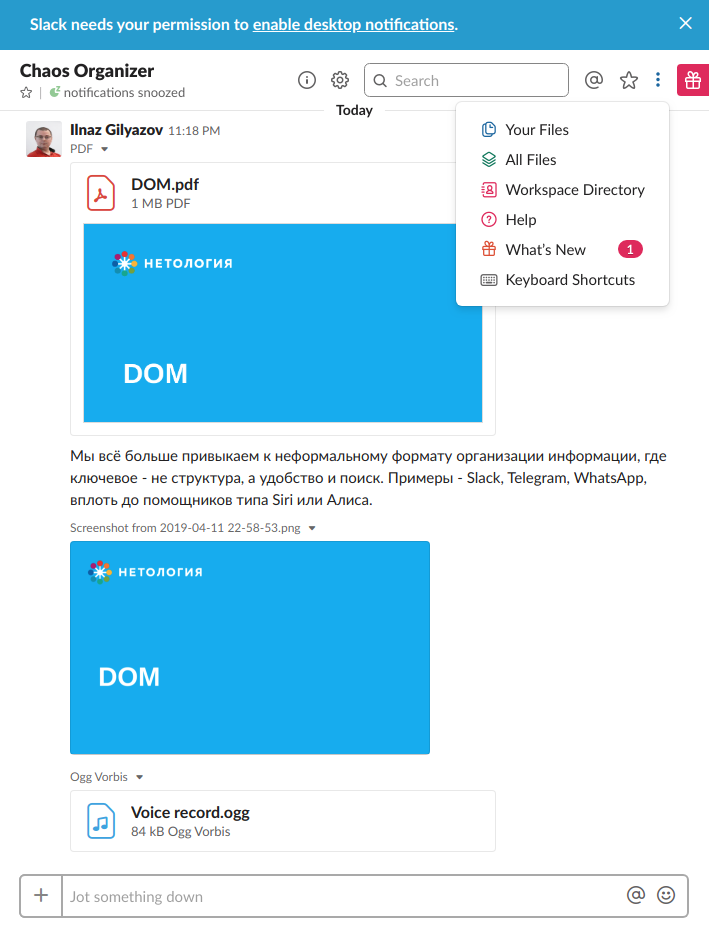
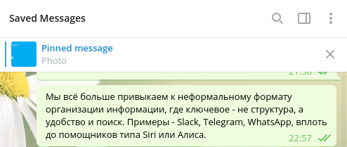

# Дипломное задание к курсу «Продвинутый JavaScript в браузере». Chaos Organizer

[](https://ci.appveyor.com/project/yuriyvyatkin/ahj-diploma-project-frontend)

[Ссылка на Github Pages](https://yuriyvyatkin.github.io/ahj-diploma-project-frontend/)

###### tags: `netology` `advanced js in html`

## Реализованные функции

### Обязательные

* Сохранение в истории ссылок и текстовых сообщений;


* Ссылки (то, что начинается с `http://` или `https://`) должны быть кликабельны и отображаться как ссылки;



* Сохранение в истории изображений, видео и аудио (как файлов) - через Drag & Drop и через иконку загрузки (скрепка в большинстве мессенджеров);


* Скачивание файлов (на компьютер пользователя);


* Ленивая подгрузка: сначала подгружаются последние 4 сообщения, при прокрутке вверх подгружаются следующие 4 и т.д.


### Дополнительные

* Синхронизация - если приложение открыто в нескольких окнах (вкладках), то контент должен быть синхронизирован;


* Отправка геолокации;


* Закрепление (pin) сообщений, закреплять можно только одно сообщение (прикрепляется к верхней части страницы);



* Добавление сообщения в избранное (тогда должен быть интерфейс для просмотра избранного);



* Просмотр вложений по категориям, например: аудио, видео, изображения, другие файлы.


## Легенда

Мы всё больше привыкаем к неформальному формату организации информации, где ключевое - не структура, а удобство и поиск. Примеры - Slack, Telegram, WhatsApp, вплоть до помощников типа Siri или Алиса.

## Основная концепция

Ключевая идея - создать бота, который предназначен как для хранения информации, так и для поиска, и других сервисов: напоминания, уведомление и интеграция с внешними сервисами.

Назовём это глобальным ботом-органайзером - вы закидывате туда всю информацию, которая вам нужна, а он сортирует, обеспечивает поиск, хранение и напоминание.

## Прототипы

В качестве прототипов для реализации мы предлагаем вам взять функциональность Telegram, WhatsApp, Slack или подобных мессенджеров, только вместо живого собеседника у вас будет бот )).

Например, скриншот Telegram:



Или Whatsapp:



Или Slack:



## Анализ

Вам нужно провести самостоятельный анализ данных приложений (можете взять альтернативы, если не пользуетесь данными, например - Viber и т.д.), изучить их способы взаимодействия и на базе них продумать, как вы будете организовывать интерфейс, и, самое главное, какие функции в первую очередь реализовывать.

## Архитектура

Поскольку вы - автор системы и ключевой её архитектор, вам предстоит самостоятельно решить, какие технологии использовать (но Webpack, Babel, ESLint и Appveyor для развёртывания - обязательны) как на клиентской, так и на серверной стороне.

Обратите внимание, Heroku:
* будет останавливать ваше приложение (все данные, хранящиеся в памяти сотрутся)
* будет удалять все ваши файлы, которые не хранятся в Git (при остановке вашего приложения)

Поэтому несколько советов:
* чтобы каталог хранился в Git (и его не приходилось создавать средствами Node.js) поместите в каталог пустой файл .gitkeep
* захардкодьте часть демо-данных (файлы и данные в памяти), чтобы было удобно проверять и не приходилось каждый раз загружать файлы

По организации серверной части мы не требуем от вас ничего, сверх того, что проходили на лекциях (этого должно быть достаточно для реализации всех функций):
* koa (и компания)
* http-event-stream
* ws

Все данные на сервере для простоты храните в памяти в виде массива (или любого другого контейнера, который вам нравится - `Set`, `Map`).

Не думайте о проблемах, связанных с хранением данных в памяти сервера (о том, что там может храниться слишком много сообщений).

## Ключевые функции

Мы, конечно, немного схитрили и уже за вас продумали ряд функций, которые обязательно должно включать в себя приложение.

Все функции разбиты на две категории:
1. Обязательные
1. Дополнительные

Все функции из `обязательных` должны быть реализованы.
Из `дополнительных` должно быть реализовано **не менее 5**, вы **сами решаете какие 5** (можете и больше) это будут.

### Обязательные для реализации функции

* Сохранение в истории ссылок и текстовых сообщений
* Ссылки (то, что начинается с `http://` или `https://`) должны быть кликабельны и отображаться как ссылки
* Сохранение в истории изображений, видео и аудио (как файлов) - через Drag & Drop и через иконку загрузки (скрепка в большинстве мессенджеров)
* Скачивание файлов (на компьютер пользователя)
* Ленивая подгрузка: сначала подгружаются последние 10 сообщений, при прокрутке вверх подгружаются следующие 10 и т.д.

### Дополнительные для реализации функции

* Синхронизация - если приложение открыто в нескольких окнах (вкладках), то контент должен быть синхронизирован
* Поиск по сообщениям (интерфейс + реализация на сервере)
* Запись видео и аудио (используя API браузера)
* Отправка геолокации
* Воспроизведение видео/аудио (используя API браузера)
* Установка напоминаний и напоминания (через Notification API), например `@schedule: 18:04 31.08.2019 "Последний день лета"`
* Отправка команд боту, например: `@chaos: погода`, бот должен отвечать рандомный прогноз погоды (интегрироваться с реальными сервисами не требуется), команд должно быть не менее 5
* Закрепление (pin) сообщений, закреплять можно только одно сообщение (прикрепляется к верхней части страницы):



* Добавление сообщения в избранное (тогда должен быть интерфейс для просмотра избранного)
* Просмотр вложений по категориям, например: аудио, видео, изображения, другие файлы (см. боковую меню Telegram)
* Работа в оффлайн-режиме (при это загруженные сообщения должны кэшироваться и быть доступными после обновления страницы)
* Экспорт/импорт истории чата
* Отправка зашифрованных сообщений и файлов (привет crypto-js!) с просмотром расшированных (для этого нужно ввести пароль) - **важно эта функция засчитывается за две**
* Архивирование файлов и распаковка (см. zip.js)
* Поддержка оформления кода, например, при отправке сообщения в бэктиках:
  <pre>
  ```
  if (true) {
    console.log('Hello, AHJ!');
  }
  ```
  </pre>

  это должно выглядеть как:
  ```javascript
  if (true) {
    console.log('Hello, AHJ!');
  }
  ```
* Поддержка смайликов (emoji)
* Поддержка стикеров


Если вы придумали интересную функцию, но её нет в этом списке, обращайтесь к @coursar.

## Требования к оформлению

### Визуальное оформление

Мы никак не ограничиваем вас с точки зрения визуального оформления, но помните, что хорошо бы, чтобы человек, уже знакомый с вышеописанными мессенджерами, без труда смог пользоваться вашим приложением.

### Техническое оформление

Всё должно быть оформлено в виде публичного репозитория на GitHub.

Для фронтенда обязательно: Webpack, Babel, ESLint и Appveyor для развёртывания.

Клиентская часть должна быть выложена на GitHub Pages (не забудьте разместить бейджик сборки и ссылку на развёрнутое приложение) либо вместе с серверной на Heroku.

### Документация

Обязательно должен быть файл README.md, в котором описано, какие функции вы реализовали и как ими пользоваться (в картинках).

**Важно**: если функция не описана, считается, что её нет.
